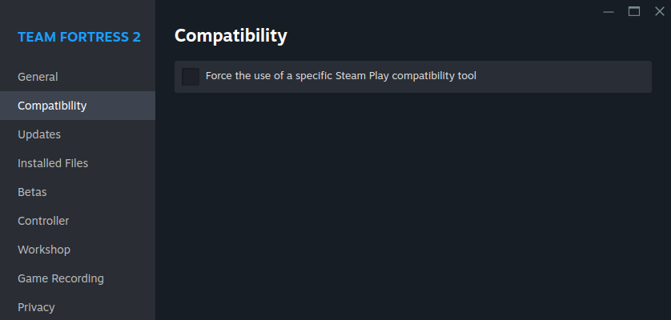
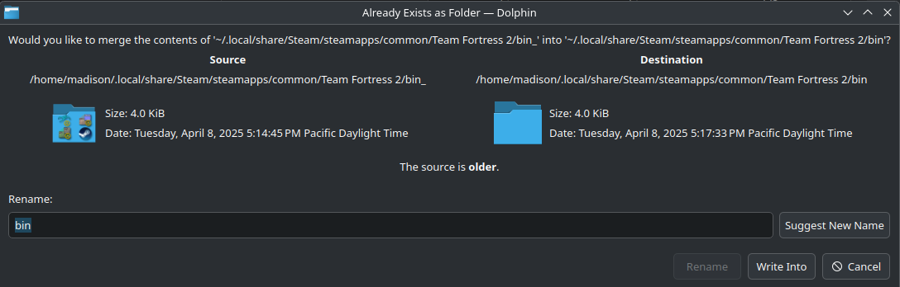

# Tutorial
Here you can find two tutorials, one for [**Windows**](#windows-tutorial), and one for [**Linux**](#linux-tutorial). If you're having trouble with your *already installed* preloader, please refer to the **[troubleshooting doc](troubleshooting.md)**.

**If you encounter any error, please try upgrading to the [latest version](https://github.com/cueki/casual-pre-loader/releases) first.**

If you need further assistance installing the preloader, or just want to chat, join the **[discord](https://discord.gg/64sNFhqUaB)**!

If you want a video supplement, please refer to the [**Video Supplement**](#video-supplement) section!

## Windows Tutorial:

### Step 1: Installation

1. **Install the latest version of the preloader from [GitHub](https://github.com/cueki/casual-pre-loader/releases) or [Gamebanana](https://gamebanana.com/tools/19049).**
2. **Once you have the zip file, extract it, and put the folder anywhere you'd like (OTHER THAN CUSTOM, <u>DO NOT PUT IT IN CUSTOM!</u>). Personally, I keep mine on my desktop.**

### Step 2: Adding your mods

1. **Prepare your mods. The preloader can handle all mods, even mods that aren't *'casual compatible',* so don't be afraid to use whatever you'd like! Once you have all the mods you want, set them aside.**
      - While you *can* put your hud in the preloader, it does the exact same thing as putting it in custom, so you don't have to if you don't want to.
      - Certain mods are either broken or outdated. I cannot guarantee that absolutely everything will work.
2. **Open the preloader by running `RUNME.bat`, and follow the first-time set-up instructions that pop up.**
      - The '*import*' tab can be ignored unless you're updating from a super old version of the preloader, or decided not to let the auto-updater update your preloader.
3. **Once the preloader is open, drag and drop your mods anywhere over the window to import them.**

### Step 3: Configuring your mods

1. **The first tab of the preloader is for your particles, on this tab you can mix and match your different particle packs for whatever look you're going for.**
      - If you want even more in-depth customization, instead of the general groups we put the particles into, navigate to the top left of your window, and un-check '*simple particle mode*'.

2. **The second tab of the preloader is everything else, including your models, animations, huds, skins, skyboxes, etc. You first check all the mods you want to use on the left by clicking on the check box next to them, then change the load order on the right by clicking and dragging.**
      - If you have an animation pack, and any model mod, make sure to load your animation pack last!

!!! note
    Some mods you install may contain the same files. When this happens, the preloader displays a caution symbol to warn you about conflicts. To resolve this, place the mod you want to see **HIGHER** in your load order *(bigger number)* so it takes priority. You can hover over the caution symbol to see how many files overlap *(just like Minecraft texture packs!)*.


### Step 4: Installing your mods to TF2

  1. **Don't forget to add `+exec w/config.cfg` to your launch options!**
     - You can do this by going onto the page for your game in Steam. Then, you go to settings, down to properties, then paste the command in your launch options!
  2. **Click install on the bottom right!**

  3. **Launch tf2 and boot up a casual match! You should see all of your mods working.**

## Linux Tutorial:
1. We need studiomdl.exe from the Windows version of TF2. First, force the use of proton in game properties, make sure to click "update" after.


2. Once updated, navigate to your `Steam/steamapps/common/Team Fortress 2/` and rename bin/ to something other than bin/, for example, bin_/.


3. Disable proton in game properties, and update again.



4. Back in `Steam/steamapps/common/Team Fortress 2/`, rename `bin_/` back to `bin/` to merge the directories, or copy its contents into `bin/`.



5. If done right, you should now see `studiomdl.exe` inside the `bin/` folder!


6. Now you can clone the repo, or install it as an [AUR package](https://aur.archlinux.org/packages/casual-pre-loader-git)!

   - Using [yay](https://github.com/Jguer/yay):
```sh
yay -S casual-pre-loader-git
casual-pre-loader
```

   - Using [paru](https://github.com/Morganamilo/paru):
```sh
paru -S casual-pre-loader-git
casual-pre-loader
```

   - Or with git:
```sh
git clone https://github.com/cueki/casual-pre-loader
cd casual-pre-loader
python -m venv .venv
source .venv/bin/activate # (you will need to activate the venv each time)
pip install -r requirements.txt
python main.py
```

If you're on Ubuntu, or an Ubuntu-based derivative (such as Mint or PopOS), you may get an error similiar to the following:
```
This application failed to start because no Qt platform plugin could be initialized. Reinstalling the application may fix this problem.
```
Installing `libxcb-cursor-dev` should solve the issue:
```sh
sudo apt-get install -y libxcb-cursor-dev
```

## Video Supplement:
<iframe width="560" height="315" src="https://www.youtube.com/watch?v=2L1A86x_m5A" frameborder="3" allow="accelerometer; autoplay; clipboard-write; encrypted-media; gyroscope; picture-in-picture" allowfullscreen></iframe>

*This will eventually be updated to the most recent version, and have a linux section - Feathers*
